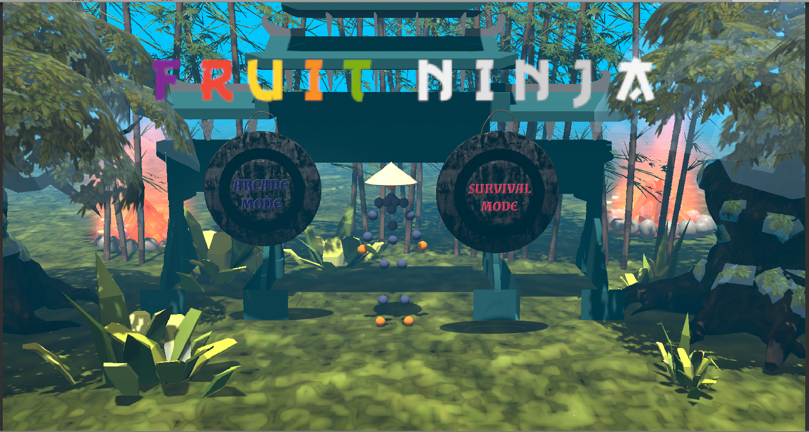
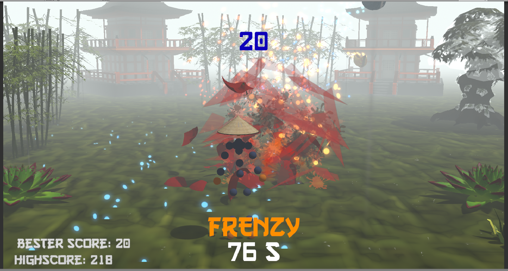
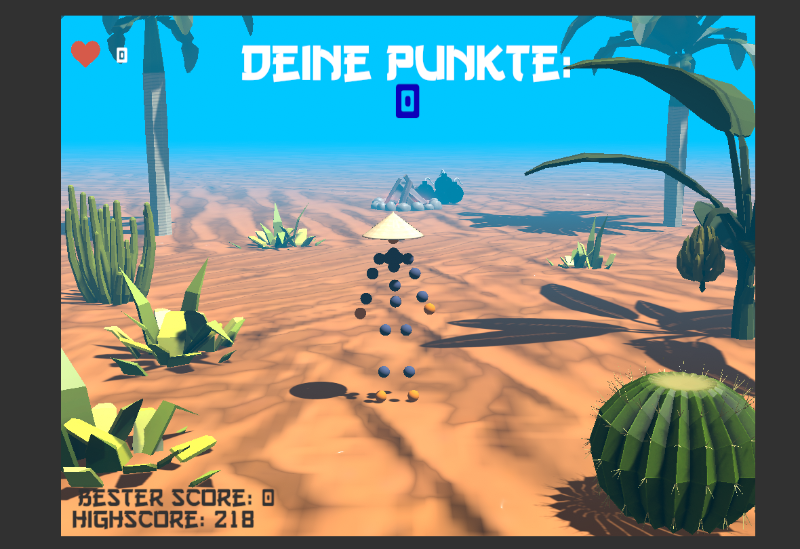

# Fruit Ninja V2

Für das Modul FcA 2019. Unity Version: 2018.3.5f1

* Requires Unity 2018.3.5.f1 !!
* Build for linux and windows

## Mein Beitrag

2 Unterschiedliche Spielmodi mit jeweils neuem Setting (Environment):
**Arcade Mode (Asiatischer Jungle)**

 und **Survival Mode (Wüstensetting)**
 

* Arcade Mode: Zerstöre so viele Früchte wie du kannst in 100s. Über Bonus Items die zufällig spawnen und eingesammelt werden müssen, können Effekte wie Multiplier, Frenzy (mehr Spawns) sowie Freeze (Zeitverlangsamung) erreicht werden.

* Survival Mode: Der Spieler hat 10 Leben und muss alle Früchte zerstören. Bomben, die zufällig spawnen muss er ausweichen, sonst GameOver!
 Über eine Geste, kann er 3 mal pro Spiel zusätzliche Items (noodle box) spawnen, die ihm extra Leben geben.

Weiteres:

- Das Spiel hat nun Background Music und Sound Effekte.
- Die Frucht Explosionen wurden überarbeitet und verschoenert.
- Alle Special Items haben zusätzliche Partikelsysteme, darunter Eisregen, gezündete Lunte, Feuerregen, Rauch, Feuer, Explosion.
- Dazu zählen: Bombe, Noodle Box, Eisbanane, Feuerbanane, Wasserbanane, Lagerfeuer.
- Der Spieler muss die Früchte mit seinen Händen oder Füssen zerstören, mit einem Messer.
- Im Hauptmenü kann man sich für einen Spielmodi entscheiden.
- Animierte Texte mit Idle und GameOver Texten.
- Angepasst an 1080p, 16:9f
